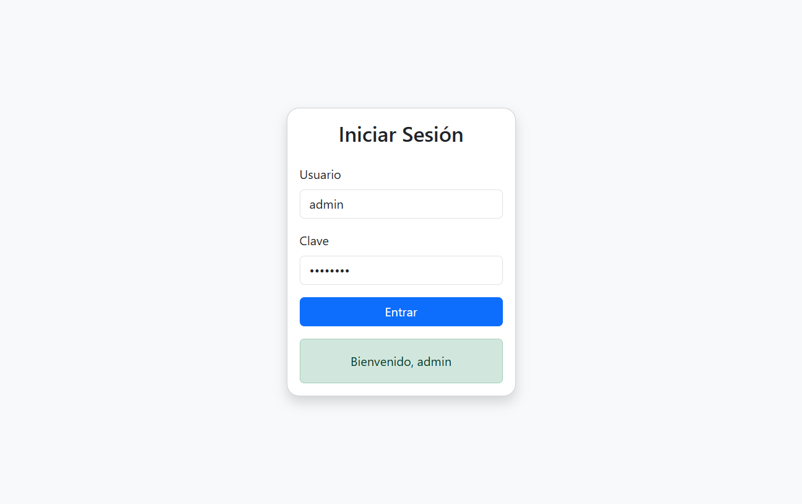

# Inicio de Sesión Automatizado con Cucumber + Selenium

## Módulo 5 - Sesión 1 - Actividad 1

## Equipo 4: 
- Eduardo Arellano
- Fabiola Díaz
- Felipe Lobos
- Carlos Vasquez

## Datos de trabajo

https://admin-login-selenium.netlify.app/
usuario "admin" y clave "admin123"

## Datos solicitados

- Captura de pantalla del reporte

- Reporte cucumber

- Consola

